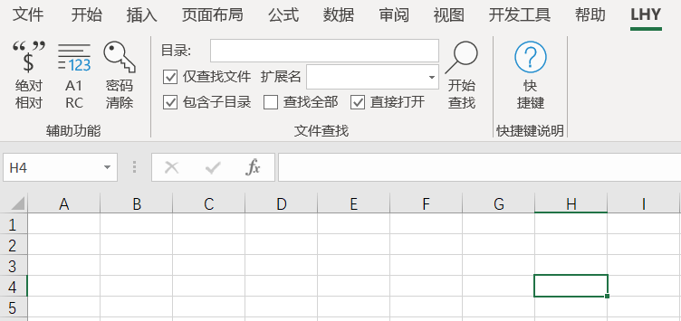

# LHY_ExcelDna
### 用户界面
  

### 功能
此插件在本人原先的VBA插件基础上重构，在.Net 4.0平台下使用ExcelDna库C#开发。  
主要是自定义的Ribbon功能区。目前实现如下功能：  

  1. 公式绝对引用和相对引用的转换  
  2. A1和R1C1形式的转换  
  3. 破解工作表写保护密码  
  4. 为合并居中单元格添加快捷键  
  5. 批量文件搜索打开文件  

后续可能会追加更多功能...

### 加载方法
本插件有两种加载方法：

1. 直接打开xll文件加载  
   打开xll文件，在弹出的提示中选择“启用此加载项”，出现功能区LHY即可。  
   直接打开的方式，重启Excel后LHY功能区消失，再次使用需要重新加载。  
2. 使用Excel加载项加载  
   打开“开发工具”功能区，选择“Excel加载项”，浏览添加此xll文件，并勾选，出现功能区LHY即可。  
   加载项的方式，重启Excel后功能区不消失。如需取消，则应在Excel加载项中删除。  

### 功能使用方法
1. 公式绝对引用和相对引用的转换  
   选中需要公式转换的单元格区域，按下Ctrl+Alt+W，就可以在绝对引用和相对引用两种形式下切换。  
2. A1和R1C1形式的转换  
   按下Ctrl+Alt+E，就可以在A1和R1C1两种形式下切换。  
3. 破解工作表写保护密码
   破解Excel写入密码，使之可写。此过程可能会占用很长时间  
4. 为合并居中单元格添加快捷键
   按下Ctrl+Q，快速合并居中单元格（或拆分单元格）  
5. 批量文件搜索打开文件  
   按下Ctrl+Alt+F，搜索名字含有活动单元格内容的文件或文件夹。  

### 修改和添加功能
+ 如果这个项目帮助了你，请给我点个星。  
+ 如果要修改功能区，请修改customUI14.xml。  
+ 如果要修改功能，请在Visual Studio中修改。  
+ 如果你有新功能的需求，欢迎给我留言，视情况添加。  
